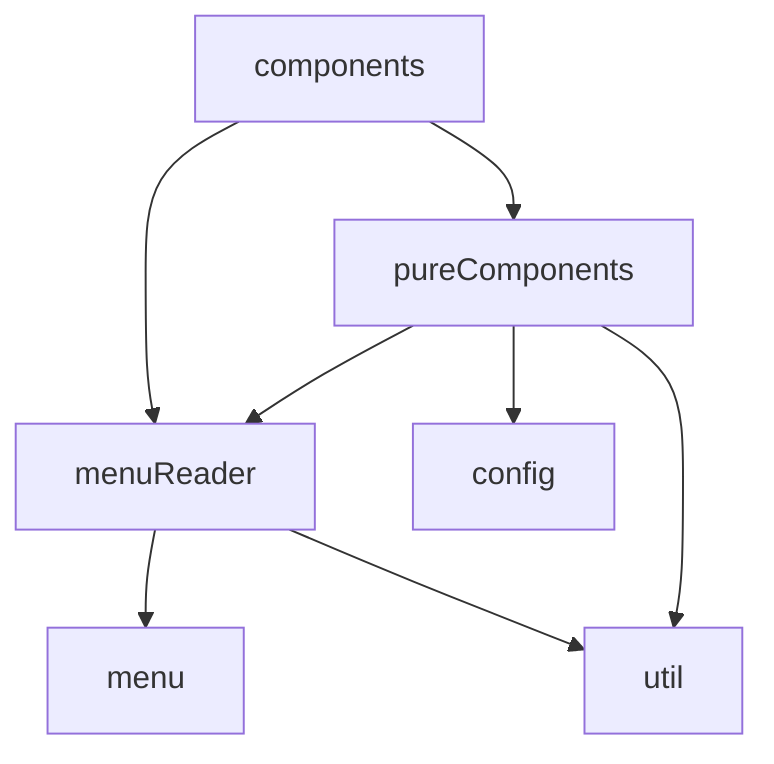

# Stazione Simulation

    <code>0% cov</code>&nbsp;
    <code>4370 sloc</code>&nbsp;
    <code>28 files</code>&nbsp;
    <code>5 deps</code>&nbsp;
    <code>8 dev deps</code>

A POS item locator side-car application and experiment with PURE COMPONENTS in React.

## Table of Contents

<!-- START doctoc generated TOC please keep comment here to allow auto update -->
<!-- DON'T EDIT THIS SECTION, INSTEAD RE-RUN doctoc TO UPDATE -->

  - [Background](#background)
  - [Architecture](#architecture)
- [Create React App frustrations](#create-react-app-frustrations)

<!-- END doctoc generated TOC please keep comment here to allow auto update -->

## Background

Caffee Stazione ~~has~~ had an aging menu-driven touchscreen POS system.

This system presented two key pain points causing a slow ordering experience for customers:

1. Learning curve associated with locating items within the menu system
2. Locating items customers would describe differently to the name used within the menu system

As a little side-project, I decided to build a "side-car" application to assist with locating items within the POS system.

The key features designed to alleviate the pain points include:

1. Ability to search the menu system and present a visualisation highlighting the sequence of button taps required to locate an item
2. Ability to assign keywords to items

## Architecture

###### 
<em>Can't see the diagram?</em> <a id="link-1" href="undefined#user-content-link-1">View it on GitHub</a>

# Create React App frustrations

- https://stackoverflow.com/questions/43011207/using-homepage-in-package-json-without-messing-up-paths-for-localhost
